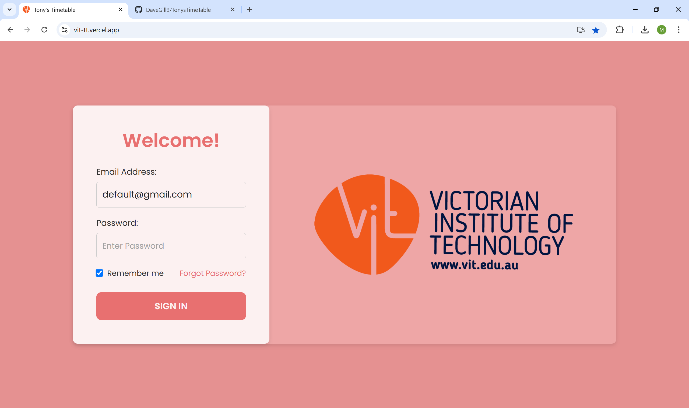
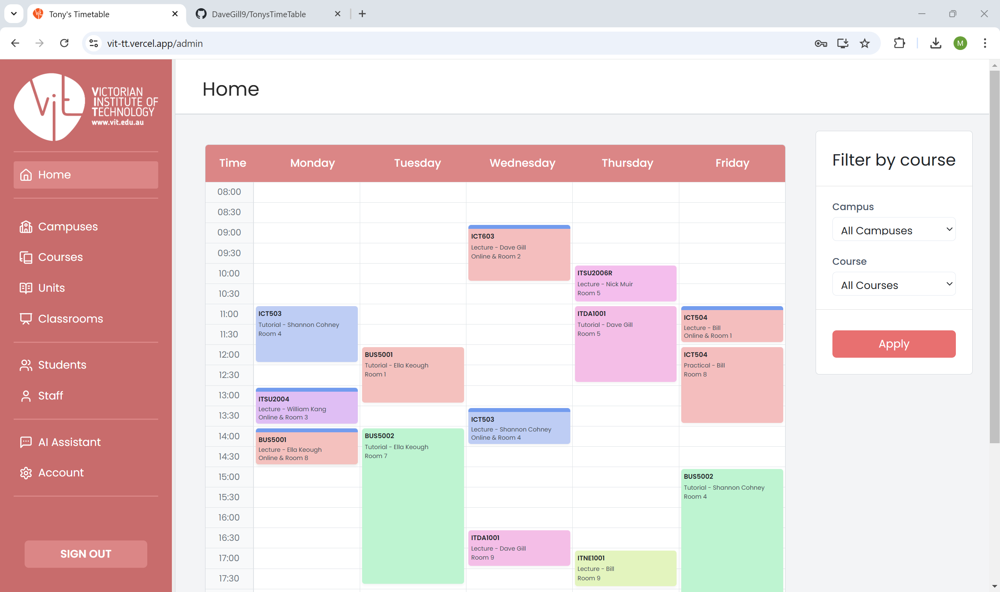
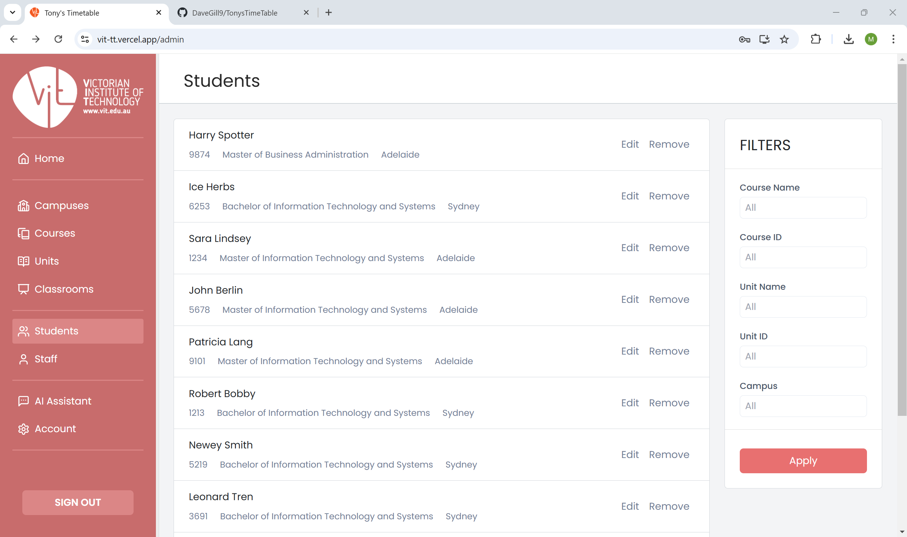
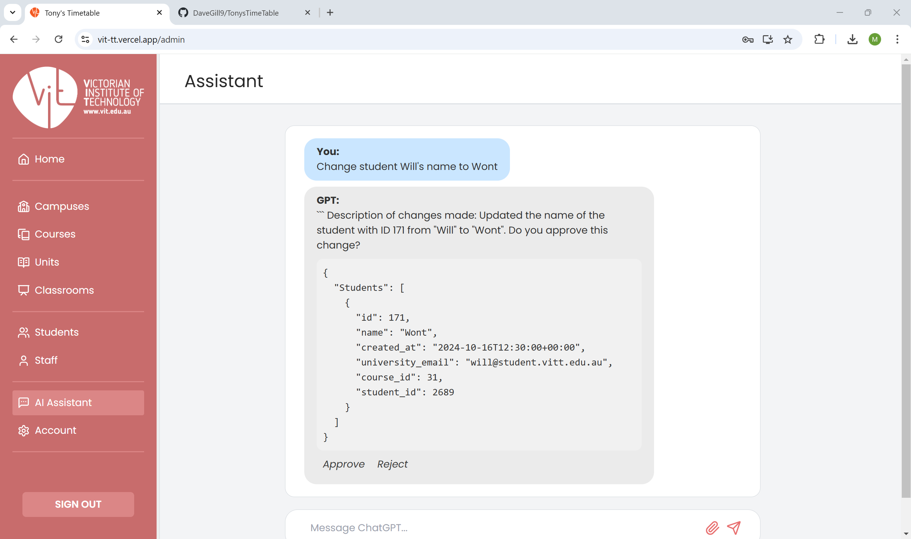

# Tony's Timetable
Junesuh Kang (William Kang) 1239956

<!-- [](LICENSE) -->

## Description
 This project is a **Timetable Management System** designed for teachers and administrators to efficiently create and manage timetables. The platform allows users to enter course and student details, enabling the automated generation of timetables. Built with React and leveraging Supabase for authentication and database management, this system is optimized for administrative use in educational institutions.

## Purpose
The purpose of this project is to deliver an efficient and reliable timetable management system tailored for educational institutions. The platform is designed to support teachers and administrators by streamlining the creation, management, and distribution of schedules. By automating key aspects of timetable management, this system aims to minimize manual scheduling efforts, reduce errors, and enhance overall operational efficiency within academic settings

## Features

- **User Authentication:** Login and registration functionality using Supabase.
- **Course Management:** Admins can create, update, and delete course schedules.
- **People Management:** Admins can create, update, and delete staff/students.
- **Generate Timetable** Admins can automatically generate new timetables for courses.
- **Export Timetable** Admins can view the active timetable of ongoing courses and export as PDF/Excel.
- **AI Assistant:** Admins can ask the bulit-in AI assistant for help with functionality.
- **Responsive Design:** This is a webpage optimized for Desktop users.

## Screenshots

#### Login Page



#### Display Timetable


#### Students Page


#### AI Assistant Page

---

## Getting Started!

### Prerequisites

- Node.js (v14 or later)
- npm (v6 or later)
- Supabase project (for authentication and database)

### Installation

1. Clone the repository:
    ```bash
    git clone https://github.com/your-username/your-project.git
    cd your-project
    ```

2. Install Depdencies:
    ```bash
    npm install
    ```

3. Set up your environment variables: Create a .env file in the root directory and add your Supabase credentials:
    ```bash
    REACT_APP_SUPABASE_URL=your-supabase-url
    REACT_APP_SUPABASE_ANON_KEY=your-supabase-key
    ```

### Running the Project

1. To start the development server:
    ```bash
    npm start
    ```

2. The app will be running at http://localhost:3000.

### Building for Production

1. To create a production build:
    ```bash
    npm run build
    ```

2. This will bundle the application into the build/ folder, ready for deployment.

## Deployment

The application is deployed on Vercel and can be accessed at the following link:

[Tony's Timetable - Live Demo](https://vit-tt.vercel.app/)

Vercel provides automatic deployment on pushes to the main branch of the repository. The deployment process is handled seamlessly through GitHub integration.

## Backend Development with Supabase

### Prerequistes
- Supabase CLI
- Docker Desktop
- Deno

### Connect to the Supabase Project
```
supabase start
supabase login
supabase link --project-ref <project-id>
# project id can be found in the project's dashboard URL
supabase db pull
```

### Create a New Edge Function
```
supabase functions new <function-name>
```

### Run Edge Function Locally
```
supabase functions serve <function-name>
```

### Deploy Edge Function
```
supabase functions deploy <function-name>
```

## Usage

Admin: Log in to create or update courses, students, staff. Generate and view timetables. 

## Project Structuture
* /src/assets: Contains all image assets.
* /src/components: Contains React components.
* /src/pages: Contains the different pages of the app.
* /src/styles: Contains CSS files for the page layout design.
* /src/supabaseClient.js: Configures Supabase authentication.

## Authors and Contact

- **Will Kang** - [juneushk@student.unimelb.edu.au](mailto:juneushk@student.unimelb.edu.au)
- **Dave Gill** - [gillsd@student.unimelb.edu.au](mailto:gillsd@student.unimelb.edu.au)
- **Michelle Gu** - [mmgu@student.unimelb.edu.au](mailto:mmgu@student.unimelb.edu.au)
- **Nick Muir** - [nmuir@student.unimelb.edu.au ](mailto:nmuir@student.unimelb.edu.au )
- **Jason Suen** - [manchits@student.unimelb.edu.au](mailto:manchits@student.unimelb.edu.au)

## licensing agreements

OpenAI API used in /supabase/functions/api, open account with OpenAI and include key to use the function, switch to another AI model (i.e. Claude, Grok) upon your wish

## Original Repo
- **Link** -https://github.com/nguyen-phm/TonysTimeTable